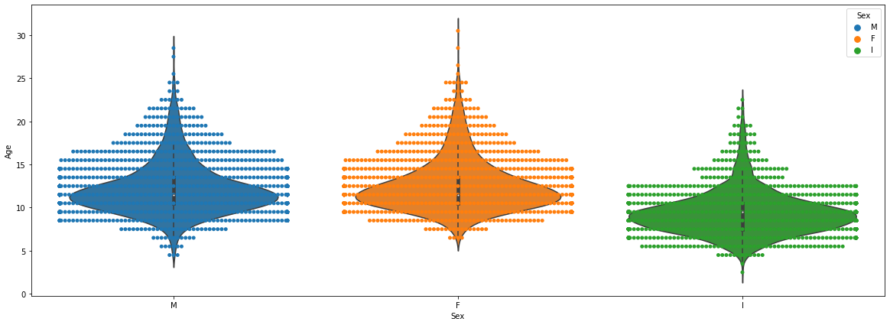

```python
'''
@Authors Mateusz Woźniak 18182, Jakub Włoch 16912
Reference: 
- https://www.kaggle.com/sriram1204/abalone-machine-learning-insights
- https://github.com/codebasics/py/blob/master/ML/10_svm/10_svm.ipynb
'''
'''
Library and data import
'''
import pandas as pd
df = pd.read_csv("C:\\Users\\emtti\\OneDrive\\Pulpit\\PJATK\\NAI\\abalone.data")
```


```python
'''Display head of data'''
df.head()
```


<div>
<style scoped>
    .dataframe tbody tr th:only-of-type {
        vertical-align: middle;
    }

    .dataframe tbody tr th {
        vertical-align: top;
    }

    .dataframe thead th {
        text-align: right;
    }
</style>
<table border="1" class="dataframe">
  <thead>
    <tr style="text-align: right;">
      <th></th>
      <th>M</th>
      <th>0.455</th>
      <th>0.365</th>
      <th>0.095</th>
      <th>0.514</th>
      <th>0.2245</th>
      <th>0.101</th>
      <th>0.15</th>
      <th>15</th>
    </tr>
  </thead>
  <tbody>
    <tr>
      <th>0</th>
      <td>M</td>
      <td>0.350</td>
      <td>0.265</td>
      <td>0.090</td>
      <td>0.2255</td>
      <td>0.0995</td>
      <td>0.0485</td>
      <td>0.070</td>
      <td>7</td>
    </tr>
    <tr>
      <th>1</th>
      <td>F</td>
      <td>0.530</td>
      <td>0.420</td>
      <td>0.135</td>
      <td>0.6770</td>
      <td>0.2565</td>
      <td>0.1415</td>
      <td>0.210</td>
      <td>9</td>
    </tr>
    <tr>
      <th>2</th>
      <td>M</td>
      <td>0.440</td>
      <td>0.365</td>
      <td>0.125</td>
      <td>0.5160</td>
      <td>0.2155</td>
      <td>0.1140</td>
      <td>0.155</td>
      <td>10</td>
    </tr>
    <tr>
      <th>3</th>
      <td>I</td>
      <td>0.330</td>
      <td>0.255</td>
      <td>0.080</td>
      <td>0.2050</td>
      <td>0.0895</td>
      <td>0.0395</td>
      <td>0.055</td>
      <td>7</td>
    </tr>
    <tr>
      <th>4</th>
      <td>I</td>
      <td>0.425</td>
      <td>0.300</td>
      <td>0.095</td>
      <td>0.3515</td>
      <td>0.1410</td>
      <td>0.0775</td>
      <td>0.120</td>
      <td>8</td>
    </tr>
  </tbody>
</table>
</div>


```python
'''Rename column names'''
df = df.rename(columns={'M': 'Sex', '0.455': 'Length', '0.364': 'Diameter', '0.095': 'Height',
                        '0.514': 'Whole weight', '0.2245': 'Shucked weight', '0.101': 'Viscera weight',
                        '0.15': 'Shell weight', '15': 'Rings'})
df.head()
```


<div>
<style scoped>
    .dataframe tbody tr th:only-of-type {
        vertical-align: middle;
    }

    .dataframe tbody tr th {
        vertical-align: top;
    }

    .dataframe thead th {
        text-align: right;
    }
</style>
<table border="1" class="dataframe">
  <thead>
    <tr style="text-align: right;">
      <th></th>
      <th>Sex</th>
      <th>Length</th>
      <th>0.365</th>
      <th>Height</th>
      <th>Whole weight</th>
      <th>Shucked weight</th>
      <th>Viscera weight</th>
      <th>Shell weight</th>
      <th>Rings</th>
    </tr>
  </thead>
  <tbody>
    <tr>
      <th>0</th>
      <td>M</td>
      <td>0.350</td>
      <td>0.265</td>
      <td>0.090</td>
      <td>0.2255</td>
      <td>0.0995</td>
      <td>0.0485</td>
      <td>0.070</td>
      <td>7</td>
    </tr>
    <tr>
      <th>1</th>
      <td>F</td>
      <td>0.530</td>
      <td>0.420</td>
      <td>0.135</td>
      <td>0.6770</td>
      <td>0.2565</td>
      <td>0.1415</td>
      <td>0.210</td>
      <td>9</td>
    </tr>
    <tr>
      <th>2</th>
      <td>M</td>
      <td>0.440</td>
      <td>0.365</td>
      <td>0.125</td>
      <td>0.5160</td>
      <td>0.2155</td>
      <td>0.1140</td>
      <td>0.155</td>
      <td>10</td>
    </tr>
    <tr>
      <th>3</th>
      <td>I</td>
      <td>0.330</td>
      <td>0.255</td>
      <td>0.080</td>
      <td>0.2050</td>
      <td>0.0895</td>
      <td>0.0395</td>
      <td>0.055</td>
      <td>7</td>
    </tr>
    <tr>
      <th>4</th>
      <td>I</td>
      <td>0.425</td>
      <td>0.300</td>
      <td>0.095</td>
      <td>0.3515</td>
      <td>0.1410</td>
      <td>0.0775</td>
      <td>0.120</td>
      <td>8</td>
    </tr>
  </tbody>
</table>
</div>


```python
'''Add Age column - Rings / integer / -- / + 1.5 gives the age in years'''
df['Age'] = df['Rings'] + 1.5
df['Age'].head()
```


    0     8.5
    1    10.5
    2    11.5
    3     8.5
    4     9.5
    Name: Age, dtype: float64


```python
import matplotlib.pyplot as plt
import seaborn as sns
%matplotlib inline
```


```python
'''Sex and Age Visulization'''
plt.figure(figsize = (20,7))
sns.swarmplot(x = 'Sex', y = 'Age', data = df, hue = 'Sex')
sns.violinplot(x = 'Sex', y = 'Age', data = df)
```


    <matplotlib.axes._subplots.AxesSubplot at 0x2d212ceac88>





```python
from sklearn.model_selection import train_test_split
from sklearn.preprocessing import LabelEncoder, OneHotEncoder
```


```python
'''LabelEnconding the Categorical Data'''
df['Sex'] = LabelEncoder().fit_transform(df['Sex'].tolist())
```


```python
'''One Hot Encoding for Sex Feature '''
transformed_sex_feature = OneHotEncoder().fit_transform(df['Sex'].values.reshape(-1,1)).toarray()
df_sex_encoded = pd.DataFrame(transformed_sex_feature, columns = ["Sex_"+str(int(i)) for i in range(transformed_sex_feature.shape[1])])
df = pd.concat([df, df_sex_encoded], axis=1)
```


```python
df.head()
```


<div>
<style scoped>
    .dataframe tbody tr th:only-of-type {
        vertical-align: middle;
    }

    .dataframe tbody tr th {
        vertical-align: top;
    }

    .dataframe thead th {
        text-align: right;
    }
</style>
<table border="1" class="dataframe">
  <thead>
    <tr style="text-align: right;">
      <th></th>
      <th>Sex</th>
      <th>Length</th>
      <th>0.365</th>
      <th>Height</th>
      <th>Whole weight</th>
      <th>Shucked weight</th>
      <th>Viscera weight</th>
      <th>Shell weight</th>
      <th>Rings</th>
      <th>Age</th>
      <th>Sex_0</th>
      <th>Sex_1</th>
      <th>Sex_2</th>
    </tr>
  </thead>
  <tbody>
    <tr>
      <th>0</th>
      <td>2</td>
      <td>0.350</td>
      <td>0.265</td>
      <td>0.090</td>
      <td>0.2255</td>
      <td>0.0995</td>
      <td>0.0485</td>
      <td>0.070</td>
      <td>7</td>
      <td>8.5</td>
      <td>0.0</td>
      <td>0.0</td>
      <td>1.0</td>
    </tr>
    <tr>
      <th>1</th>
      <td>0</td>
      <td>0.530</td>
      <td>0.420</td>
      <td>0.135</td>
      <td>0.6770</td>
      <td>0.2565</td>
      <td>0.1415</td>
      <td>0.210</td>
      <td>9</td>
      <td>10.5</td>
      <td>1.0</td>
      <td>0.0</td>
      <td>0.0</td>
    </tr>
    <tr>
      <th>2</th>
      <td>2</td>
      <td>0.440</td>
      <td>0.365</td>
      <td>0.125</td>
      <td>0.5160</td>
      <td>0.2155</td>
      <td>0.1140</td>
      <td>0.155</td>
      <td>10</td>
      <td>11.5</td>
      <td>0.0</td>
      <td>0.0</td>
      <td>1.0</td>
    </tr>
    <tr>
      <th>3</th>
      <td>1</td>
      <td>0.330</td>
      <td>0.255</td>
      <td>0.080</td>
      <td>0.2050</td>
      <td>0.0895</td>
      <td>0.0395</td>
      <td>0.055</td>
      <td>7</td>
      <td>8.5</td>
      <td>0.0</td>
      <td>1.0</td>
      <td>0.0</td>
    </tr>
    <tr>
      <th>4</th>
      <td>1</td>
      <td>0.425</td>
      <td>0.300</td>
      <td>0.095</td>
      <td>0.3515</td>
      <td>0.1410</td>
      <td>0.0775</td>
      <td>0.120</td>
      <td>8</td>
      <td>9.5</td>
      <td>0.0</td>
      <td>1.0</td>
      <td>0.0</td>
    </tr>
  </tbody>
</table>
</div>


```python
'''Prepare sets for learning and predicting features'''
Xtrain = df.drop(['Rings','Age','Sex'], axis = 1)
Ytrain = df['Rings']
```


```python
'''Train Test Split , 70:30 Ratio'''
X_train, X_test, Y_train, Y_test = train_test_split(Xtrain, Ytrain, test_size=0.33, random_state=42)
```


```python
len(X_train)
```


    2797


```python
len(X_test)
```


    1379


```python
'''Train model using Support Vector Machine'''
from sklearn.svm import SVC
model = SVC()
model.fit(X_train, Y_train)
```


    SVC(C=1.0, break_ties=False, cache_size=200, class_weight=None, coef0=0.0,
        decision_function_shape='ovr', degree=3, gamma='scale', kernel='rbf',
        max_iter=-1, probability=False, random_state=None, shrinking=True,
        tol=0.001, verbose=False)


```python
'''Accuracy score for predicted set'''
model.score(X_test, Y_test)
```


    0.2668600435097897


```python
'''Adjust kernel, gamma and regularization'''
linear_model = SVC(kernel='linear', C=1, gamma=1)
linear_model.fit(X_train, Y_train)
```


    SVC(C=1, break_ties=False, cache_size=200, class_weight=None, coef0=0.0,
        decision_function_shape='ovr', degree=3, gamma=1, kernel='linear',
        max_iter=-1, probability=False, random_state=None, shrinking=True,
        tol=0.001, verbose=False)


```python
'''Accuracy score for predicted set after adjustments'''
linear_model.score(X_test,Y_test)
```


    0.252356780275562


```python
new_df = df.copy()
import numpy as np
```


```python
'''Feature Engineering , class 1 - 1-8, class 2 - 9-8, class 3 - 11 >'''
new_df['newRings_1'] = np.where(df['Rings'] <= 8,1,0)
new_df['newRings_2'] = np.where(((df['Rings'] > 8) & (df['Rings'] <= 10)), 2,0)
new_df['newRings_3'] = np.where(df['Rings'] > 10,3,0)
```


```python
new_df['newRings'] = new_df['newRings_1'] + new_df['newRings_2'] + new_df['newRings_3']
```


```python
new_df.head()
```


<div>
<style scoped>
    .dataframe tbody tr th:only-of-type {
        vertical-align: middle;
    }

    .dataframe tbody tr th {
        vertical-align: top;
    }

    .dataframe thead th {
        text-align: right;
    }
</style>
<table border="1" class="dataframe">
  <thead>
    <tr style="text-align: right;">
      <th></th>
      <th>Sex</th>
      <th>Length</th>
      <th>0.365</th>
      <th>Height</th>
      <th>Whole weight</th>
      <th>Shucked weight</th>
      <th>Viscera weight</th>
      <th>Shell weight</th>
      <th>Rings</th>
      <th>Age</th>
      <th>Sex_0</th>
      <th>Sex_1</th>
      <th>Sex_2</th>
      <th>newRings_1</th>
      <th>newRings_2</th>
      <th>newRings_3</th>
      <th>newRings</th>
    </tr>
  </thead>
  <tbody>
    <tr>
      <th>0</th>
      <td>2</td>
      <td>0.350</td>
      <td>0.265</td>
      <td>0.090</td>
      <td>0.2255</td>
      <td>0.0995</td>
      <td>0.0485</td>
      <td>0.070</td>
      <td>7</td>
      <td>8.5</td>
      <td>0.0</td>
      <td>0.0</td>
      <td>1.0</td>
      <td>1</td>
      <td>0</td>
      <td>0</td>
      <td>1</td>
    </tr>
    <tr>
      <th>1</th>
      <td>0</td>
      <td>0.530</td>
      <td>0.420</td>
      <td>0.135</td>
      <td>0.6770</td>
      <td>0.2565</td>
      <td>0.1415</td>
      <td>0.210</td>
      <td>9</td>
      <td>10.5</td>
      <td>1.0</td>
      <td>0.0</td>
      <td>0.0</td>
      <td>0</td>
      <td>2</td>
      <td>0</td>
      <td>2</td>
    </tr>
    <tr>
      <th>2</th>
      <td>2</td>
      <td>0.440</td>
      <td>0.365</td>
      <td>0.125</td>
      <td>0.5160</td>
      <td>0.2155</td>
      <td>0.1140</td>
      <td>0.155</td>
      <td>10</td>
      <td>11.5</td>
      <td>0.0</td>
      <td>0.0</td>
      <td>1.0</td>
      <td>0</td>
      <td>2</td>
      <td>0</td>
      <td>2</td>
    </tr>
    <tr>
      <th>3</th>
      <td>1</td>
      <td>0.330</td>
      <td>0.255</td>
      <td>0.080</td>
      <td>0.2050</td>
      <td>0.0895</td>
      <td>0.0395</td>
      <td>0.055</td>
      <td>7</td>
      <td>8.5</td>
      <td>0.0</td>
      <td>1.0</td>
      <td>0.0</td>
      <td>1</td>
      <td>0</td>
      <td>0</td>
      <td>1</td>
    </tr>
    <tr>
      <th>4</th>
      <td>1</td>
      <td>0.425</td>
      <td>0.300</td>
      <td>0.095</td>
      <td>0.3515</td>
      <td>0.1410</td>
      <td>0.0775</td>
      <td>0.120</td>
      <td>8</td>
      <td>9.5</td>
      <td>0.0</td>
      <td>1.0</td>
      <td>0.0</td>
      <td>1</td>
      <td>0</td>
      <td>0</td>
      <td>1</td>
    </tr>
  </tbody>
</table>
</div>


```python
'''Learning Features and Predicting Features'''
Xtrain = new_df.drop(['Rings','Age','Sex','newRings_1','newRings_2','newRings_3'], axis = 1)
Ytrain = new_df['newRings']
```


```python
'''Train Test Split , 70:30 Ratio'''
X_train, X_test, Y_train, Y_test = train_test_split(Xtrain, Ytrain, test_size=0.33, random_state=42)
```


```python
linear_model = SVC(kernel='linear', C=1, gamma=1)
linear_model.fit(X_train, Y_train)
```


    SVC(C=1, break_ties=False, cache_size=200, class_weight=None, coef0=0.0,
        decision_function_shape='ovr', degree=3, gamma=1, kernel='linear',
        max_iter=-1, probability=False, random_state=None, shrinking=True,
        tol=0.001, verbose=False)


```python
linear_model.score(X_test,Y_test)
```


    1.0


